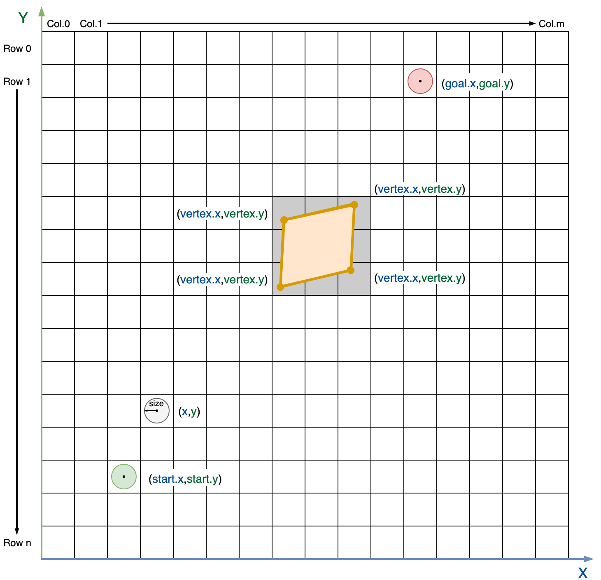

# ORCA* ROS
Decentralized navigation system based on ORCA and Theta* algorithms and implemented as ROS nodes

## ORCA* Algorithm

### Description
The algorithm is based on the idea of planning a global path for all agents independently and moving along this path with local collision avoidance. Theta* algorithm are using to global path planning and ORCA algorithm are using for local collision avoidance with agents and static obstacles. Also direct moving to goal without global planning is available.

__Theta*__ is a version of A* algorithm for any-angle path planning on grids. Theta* mostly the same as A*, but, unlike A*, Theta* allows parent of current vertex may be any other vertex, which are visible from current [[1](https://arxiv.org/pdf/1401.3843.pdf)].

The __ORCA__ algorithm is a decentralized collision avoidance algorithm in a multi-agent environment. The main idea of ​​the algorithm is iterative selection of new agent speed, close to a certain preferred velocity. Selection of the new speed is based on ORCA principle. **Optimal Reciprocal Collision Avoidance (ORCA)** — the principle, which provides a sufficient condition for multiple robots to avoid collisions among one another, and thus can guarantee collision-free navigation [[2](http://gamma.cs.unc.edu/ORCA/publications/ORCA.pdf)].
The principle is based on the concept of velocity obstacles, which are used to search for a new  speed of agent so that during the time _t_ there is no collision with other agents. In the process of searching for a new velocity, algorithm creates a set of n-1 linear constraints(where n is the number of agents that the current one takes into account). A new velocity (Vnew) that satisfies these constraints and is close to the preferred velocity, are searched using an linear programming. The preferred velocity is selected so that the agent makes a move to the target point. More information about ORCA algorithm you can find at ORCA creators web page [[3](http://gamma.cs.unc.edu/ORCA/)].

The agent is a disk of radius _r_ with buffer radius _ε_ centered at _p_ with their start and global goal positions. 


<p align="center">
  
</p>

For each neighboring agent (located at a distance _R_ or less), their position and current speed are known. At the beginning of task execution every agent tries to find a path to their global goal, using Theta* algorithm. After getting of global path (which is a sequence of points in space, where the first point is the global goal), agent begin moving. First target point is the last element in path sequence. At each simulation step, for each agent, a new velocity _Vnew_ are searched, using ORCA algorithm. After that global simulation time is changed to _dt_, the position of all agents is changed to _dt_ * _Vnew_ (own for each agent) and every agent compute new target point. If the agent has reached the last point in the sequence, then the next point in the sequence becomes the target, and the previous one is deleted. Otherwise, a visibility check is made between the agent’s position and the last point. If visibility is confirmed, then the last becomes the target point, otherwise the path from the agent's position to the last point is searched.

Block scheme of the algorithm is shown in the figures below.

<p align="center">
  
</p>


The implementation of ORCA* algorithm located in `./ORCAStarLib/` subdirectory. It based on [[4](https://github.com/PathPlanning/ORCA-algorithm)]. Implementation relies only on C++11 standard and STL. I/O modules use open-source library tinyXML to work with XML. It is included at the source level (i.e. .h and .cpp files are part of the project) in `./ORCAStarLib/tinyxml/` subdirectory. Full documentation for ORCA* implementation source code located **[HERE]**.

## ROS Imlemetation

### Requirements

To build and run ORCA* ROS you nedd the following software: 
* C++ compiler with C++11 support (tested on GCC 5.4.0);
* Python 2.7;
* CMake 3.5;
* ROS Kinetic (Desktop-Full) [[5](http://wiki.ros.org/kinetic/Installation)];
* ROS map_server [[6](http://wiki.ros.org/map_server)] .


Tested on the following configuration:

<p align="center">
  
</p>

### Installing

Download current repository to your local machine. Use

```bash
git clone https://github.com/haiot4105/ORCAStarROS.git
```
or direct downloading.

Add installation path to ROS_PACKAGE_PATH variable
```bash
export ROS_PACKAGE_PATH=*installation path*:$ROS_PACKAGE_PATH
```


### Build

Go to the directory with ORCAStar using teminal.

```bash
roscd ORCAStar
```

Start building process using rosmake
```bash
rosmake .
```

### Run Tests

Tests use gtest library, which is included to ROS. To build tests run following command:

```bash
make test
```

To run tests run commands:

```bash
cd bin/test
./ORCAStarTest 
```

### Single Agent

The main part in a navigation system is the single agent navigation module. This component can be used both for embedding a separate robot and for centralized calculation of trajectories, but using distributed computing.
The single agent navigation implemented as a ROS node. The node operation is divided into 2 stages.

At the first stage, node is initialized, the algorithms parameters and static environment data are requested from ROS services, global path is created. The node sends a request to service <code>initAgentServer_*id*</code> (Service description: **[LINK]**, `id` is identifier of agent, which sets as ROS private parameter) and awaits a response. For using ROS Agent node you should launch such service. After that, the node sends a request to the service `static_map` of `map_server` node. You should launch this node before launching ROS Agent node. 

At the second stage the process of following the global path starts. 
The node waits for messages in topic `AgentInput_*id*`. After a message with input data (**[LINK]**) appears in the topic `AgentInput_*id*`, new velocity computation procedure starts. New velocity publishes in the topic `AgentOutput_*id*` (in [geometry_msgs::Point32](http://docs.ros.org/api/geometry_msgs/html/msg/Point32.html) format). The second stage continues until the node is working. An illustration of the operation of the node is presented in the figure below.

<p align="center">
  
</p>

#### Launch

To launch single agent ROS node `rosrun` util can be used. 
```bash
rosrun ORCAStar ROSAgent _id:=0
```
Roslaunch files also can be used.
```xml
<node name="$(anon ROSAgent_0)" pkg="ORCAStar" type="ROSAgent">
  <param name="id" type="int" value="0"/>
</node>
```
If you are launching a single instance of the node, then use parameter `id` equal to any integer (0 for example). When running multiple instances, use unique values.

#### I/O Format

As input and output uses following ROS services and topics:
- `initAgentServer_id` — initial input data service, which uses [Init service format](). Initial input data contains algorithms parameters, agent parameters, start and goal positions and static obstacles description in form of polygons. 
- `static_map` — service of `map_server` [[6](http://wiki.ros.org/map_server)] node, which stores information about static environment in form of grid.
- `AgentInput_*id*` — ROS topic for providing input data on each step of following the global path. It uses [ORCAInput message format](), which includes current position and velocity of agent and states of other agents.
-  `AgentOutput_*id*` — ROS topic for receiving result velocity from ORCAStar algorithm. It uses [geometry_msgs::Point32](http://docs.ros.org/api/geometry_msgs/html/msg/Point32.html) message format.


#### Map Format

The map is set in the form of a grid, are also described in the form of polygons. The grid is a rectangular matrix of square cells, each cell can be traversable or not. The size of cell side is variable. The address of each cell on the grid is specified by a pair `(i, j)`, where `i` is the row number of the matrix, `j` is the column number of the matrix. The environment description is specified in the orthogonal coordinates. Every obstacle in form of polygon is vector of points in orthogonal coordinates. Vertices of the simple obstacle shold be listed in counterclockwise order, vertices of boundary in clockwise order. An illustration of the environment is presented in the figure below.

<p align="center">
  
</p>

### Multiple Agents

Based on the autonomous navigation module of a single agent, a simple simulation of the work of a group of agents was built. These modules can be used to verify the operation of the navigation system or as an example of using a single agent module.

System includes the following modules. The main module (`ROSMission`) is responsible for storing, updating and transmitting data about the state of the entire system. Intermediate module (`ROSSimActor`) is responsible for the interaction between the main module and the single agent navigation module. A  navigation module for a single agent (`ROSAgent`). In addition, the system uses a standard ROS node that provides environmental information on request in the format of a grid ([[6](http://wiki.ros.org/map_server)]).

At the initial stage of operation, the `ROSMission` node reads information on the agents parameters, start and end positions, as well as data on static obstacles from an XML file, the path to which is specified in the format of the private ROS parameter. After that, agents are registered in `ROSMission`. The main module creates the initialization service and expects the required number of requests (equal to the number of agents), in response to each request, the identifier of the new registered participant in the system, data on the initial and final position of the new agent, agent parameters and data on the static environment are transmitted. When the required number of agents has been registered, the central module creates a topic where the states of all agents are published at discrete time steps. In addition, the central module subscribes to the topic where the results of calculating the new velocities of each agent are published. After the preparatory operations are completed, a cyclic process is started, consisting of publishing the states of agents, obtaining speeds, updating the status of agents. The period of operation of one iteration of the cycle is constant, i.e. new iterations are launched at regular intervals.

During the initial stage, every `ROSSimActor` node sends a request to the central module to register a new participant in the system and obtain the necessary input data for a specific agent. Then, in a similar way, the `ROSAgent` navigation module is initialized (a `ROSSimActor` node creates a service waiting for a request from a `ROSAgent` node). The navigation module also requests information about static obstacles in the format of a grid from the map_server node. Every `ROSSimActor` node subscribes to a topic containing the states of all agents and registers as a publisher in a topic that accepts all computed agent velocities. In addition, two-way communication is creating using topics between the intermediate module and the single agent navigation module.

After the initial stage is completed, the `ROSSimActor` nodes wait publication of data on the current state of all agents, then every `ROSSimActor` node selects the neighbors of the specific agent. An input message is generated for `ROSAgent` node. The `ROSAgent` nodes receive input, compute the velocity, and pass velocities back to the `ROSSimActor` nodes. An illustration of nodes with ROS themes for a system of 5 agents is presented in the figure below.

<p align="center">
  
</p>


#### Launch

To launch ROS Mission it is recommended to use `roslaunch`. The following nodes must be started:
- `ROSMission` — the main node, which manage all simulation;
  - `agents_number` — integer parameter, which defines the number of agents in simulation;
  - `task` — string parameter, which defines a global path to input XML file;
  - `threshhold`  — integer parameter, which defines a step threshhold for simulation;
  - `end` — boolean parameter, which sets the simulation to stop when all agents reach their goal positions or step counter reach the threshold of steps.
- `map_server` — the node, which stores information about static environment in form of grid [[6](http://wiki.ros.org/map_server)].
- `ROSSimActor` — the intermediate node between the simulation and the agent. Responsible for transmitting only the necessary information from `ROSMission` to `ROSAgent`. You must run the same number of nodes as the number of agents in the simulation
- `ROSAgent` — a single agent navigation node. You must run the same number of nodes as the number of agents in the simulation;
  - `id` — integer parameter, which defines the identifier of agent. Should be unique.
- `ROSVisualization`, `rviz` — optional nodes for visualization.

Python script `./scripts/generate.py` can be used for generating launch files from XML task files.

Example of launch file is presented below and in `./examples/` subdirectory.

```xml
<launch>
  <node name="map_server" pkg="map_server" type="map_server" args="/home/User/ORCAStar/examples/0_task.yml"/>


  <node name="ROSMission" pkg="ORCAStar" type="ROSMission" output="screen">
    <param name="agents_number" type="int" value="5"/>
    <param name="task" type="string" value="/home/User/ORCAStar/examples/0_task.xml"/>
    <param name="threshhold" type="int" value="1000"/>
    <param name="end" type="bool" value="False"/>
  </node>

  <node name="$(anon ROSSimActor_0)" pkg="ORCAStar" type="ROSSimActor"/>
  <node name="$(anon ROSAgent_0)" pkg="ORCAStar" type="ROSAgent">
    <param name="id" type="int" value="0"/>
  </node>

  <node name="$(anon ROSSimActor_1)" pkg="ORCAStar" type="ROSSimActor"/>
  <node name="$(anon ROSAgent_1)" pkg="ORCAStar" type="ROSAgent">
    <param name="id" type="int" value="1"/>
  </node>

  <node name="$(anon ROSSimActor_2)" pkg="ORCAStar" type="ROSSimActor"/>
  <node name="$(anon ROSAgent_2)" pkg="ORCAStar" type="ROSAgent">
    <param name="id" type="int" value="2"/>
  </node>

  <node name="$(anon ROSSimActor_3)" pkg="ORCAStar" type="ROSSimActor"/>
  <node name="$(anon ROSAgent_3)" pkg="ORCAStar" type="ROSAgent">
    <param name="id" type="int" value="3"/>
  </node>

  <node name="$(anon ROSSimActor_4)" pkg="ORCAStar" type="ROSSimActor"/>
  <node name="$(anon ROSAgent_4)" pkg="ORCAStar" type="ROSAgent">
    <param name="id" type="int" value="4"/>
  </node>

  <node name="rviz" pkg="rviz" type="rviz"/>
  <node name="ROSVisualization" pkg="ORCAStar" type="ROSVisualization"/>
</launch>
```

#### I/O Format

Input files are an XML files with a specific structure. Map format is the same as for single agent. Example of XML files are presented in `./examples/` subdirectory.
Input file should contain:

* Mandatory tag `<agents>`. It describes the parameters of the agents.
    * `number` — mandatory attribute that define the number of agents;
    * `<default_parameters>` — mandatory tags that defines default parameters of agents and agent's perception.
      * `agentsmaxnum` — mandatory attribute that defines a number of neighbors, that the agent takes into account;
      * `movespeed` — mandatory attribute that defines maximum speed of agent;
      * `sightradius` — mandatory attribute that defines the radius in which the agent takes neighbors into account;
      * `size` — mandatory attribute that defines size of the agent (radius of the agent);
      * `timeboundary` — mandatory attribute that defines the time within which the algorithm ensures collision avoidance with other agents;
      * `timeboundaryobst` — mandatory attribute that defines the time within which the algorithm ensures collision avoidance with static obstacles.
    * `<agent>` — mandatory tags that defines parameters of each agent.
        * `id` — mandatory attribute that defines the identifier of agent;
        * `start.xr` — mandatory attribute that defines the coordinate of start position on the x-axis (hereinafter, excluding `map` tag, points (x,y) are in coordinate system, which has an origin (0,0) in lower left corner. More about coordinate systems in the map format section);
        * `start.yr` — mandatory attribute that defines the coordinate of start position on the y-axis;
        * `goal.xr` — mandatory attribute that defines the coordinate of finish position on the x-axis;
        * `goal.yr` — mandatory attribute that defines the coordinate of finish position on the y-axis;
        * `agentsmaxnum` — attribute that defines a number of neighbors, that the agent takes into account;
        * `movespeed` — attribute that defines maximum speed of agent;
        * `sightradius` — attribute that defines the radius in which the agent takes neighbors into account;
        * `size` — attribute that defines size of the agent (radius of the agent);
        * `timeboundary` — attribute that defines the time within which the algorithm ensures collision avoidance with other agents;
        * `timeboundaryobst` — attribute that define the time within which the algorithm ensures collision avoidance with static obstacles.
* Mandatory tag `<map>`. It describes the environment for global path planning.
  * `<height>` and `<width>` — mandatory tags that define size of the map. Origin is in the upper left corner. (0,0) - is upper left, (*width*-1, *height*-1) is lower right (more about coordinate systems in the map format section.
  * `<cellsize>` — optional tag that defines the size of one cell.
  * `<grid>` — mandatory tag that describes the square grid constituting the map. It consists of `<row>` tags. Each `<row>` contains a sequence of "0" and "1" separated by blanks. "0" stands for traversable cell, "1" — for untraversable (actually any other figure but "0" can be used instead of "1").

* Mandatory tag `<obstacles>`. It describes static obstacles for collision avoidance.
  * `number` — mandatory attribute that defines the number of obstacles;
  * `<obstacle>` — mandatory tags which defines each static obstacles for collision avoidance.
    * `<vertex>` — mandatory tags which defines vertex of static obstacle for collision avoidance.
      *  `xr` — mandatory attribute that defines the coordinate of vertex on the x-axis;
      *  `yr` — mandatory attribute that defines the coordinate of vertex on the y-axis.

* Mandatory tag `<algorithm>`. It describes the parameters of the algorithm.
  * `<delta>` — mandatory tag that defines the distance between the center of the agent and the finish, which is enough to reach the finish (ORCA parameter);
  * `<timestep>` — mandatory tag that defines the time step of simulation (ORCA parameter);
  * `<searchtype>` — tag that defines the type of planning. Possible values - "thetastar" (use Theta* for planning), "direct" (turn off global planning and always use direction to global goal). Default value is "thetastar" (global planning parameter);
  * `<breakingties>` — tag that defines the priority in OPEN list for nodes with equal f-values. Possible values - "0" (break ties in favor of the node with smaller g-value), "1" (break ties in favor of the node with greater g-value). Default value is "0" (Theta* parameter);
  * `<cutcorners>` — boolean tag that defines the possibilty to make diagonal moves when one adjacent cell is untraversable. The tag is ignored if diagonal moves are not allowed. Default value is "false" (Theta* parameter);
  *  `<allowsqueeze>` — boolean tag that defines the possibility to make diagonal moves when both adjacent cells are untraversable. The tag is ignored if cutting corners is not allowed. Default value is "false" (Theta* parameter);
  *  `<hweight>` — defines the weight of the heuristic function. Should be real number greater or equal 1. Default value is "1" (Theta* parameter);

Output of simulation is made to topic `AgentStates` using message format [AgentState](). It includes positions, velocities and sizes of all agent on current step. 

#### Visualisation
The simulation visualized using `rviz`. To use visualization add floowing nodes to the launch file. Examples of rviz config files are presented in `./examples/` subdirectory.

```xml
  <node name="rviz" pkg="rviz" type="rviz"/>
  <node name="ROSVisualization" pkg="ORCAStar" type="ROSVisualization"/>
```

Example of visualized simulation is presented below.

<p align="center">
  
</p>

## Source Code Documentation

Full source code documentation is presented [here]().

Documentation for ROS messages and services is presented [here]()

## Links

1. [Daniel K. et al. Theta*: Any-angle path planning on grids // Journal of Artificial Intelligence Research. – 2010. – vol. 39. – p. 533-579.](https://arxiv.org/pdf/1401.3843.pdf)
2. [Van Den Berg J. et al. Reciprocal n-body collision avoidance // Robotics research. – Springer, Berlin, Heidelberg, 2011. – p. 3-19.](http://gamma.cs.unc.edu/ORCA/publications/ORCA.pdf)
3. [ORCA creators webpage](http://gamma.cs.unc.edu/ORCA/)
4. [ORCA* algoritm implementation](https://github.com/PathPlanning/ORCA-algorithm)
5. [ROS Kinetic installation instructions](http://wiki.ros.org/kinetic/Installation)
6. [map_server node description](http://wiki.ros.org/map_server)
